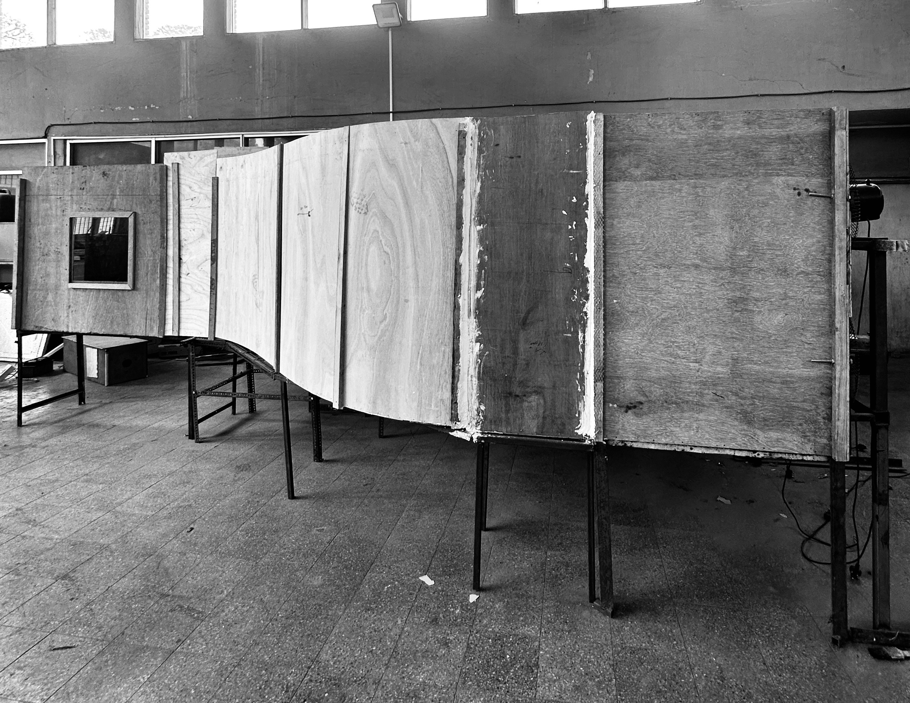
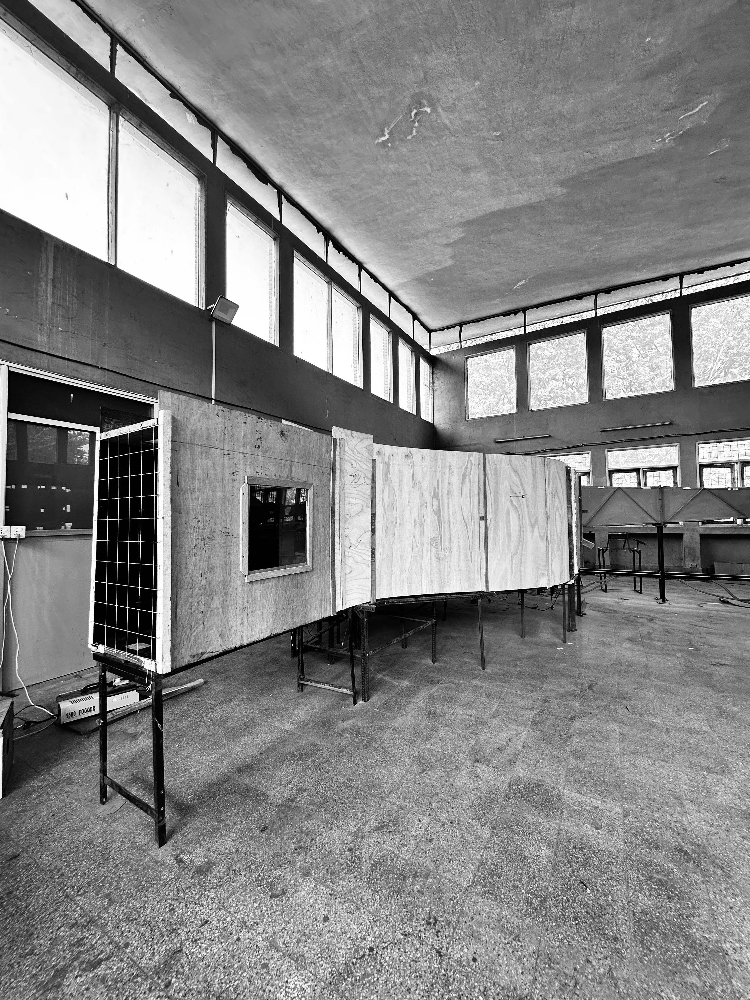
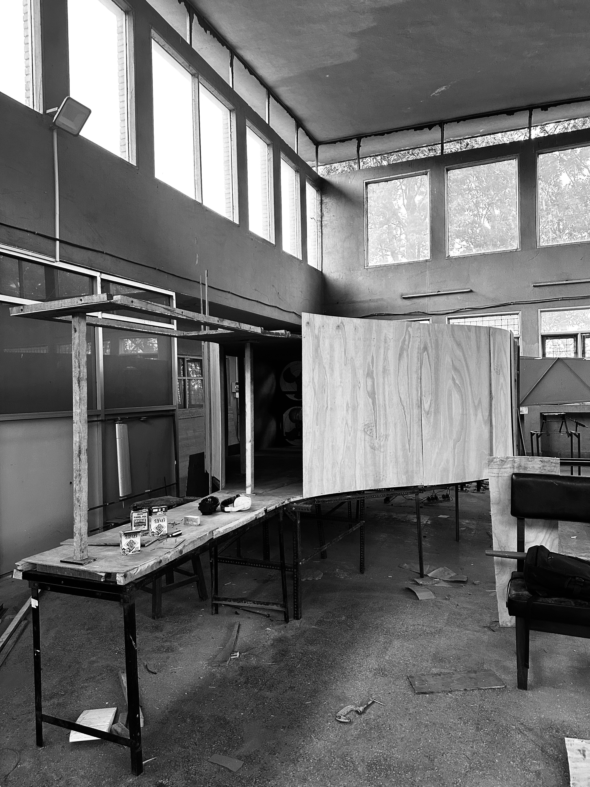

<!DOCTYPE html>
<html lang="en">
<head>
  <meta charset="UTF-8"/>
  <meta name="viewport" content="width=device-width, initial-scale=1.0"/>
  <title>Nischal Raut | Aerospace Engineer</title>
  <!-- Google Fonts -->
  <link href="https://fonts.googleapis.com/css2?family=Montserrat:wght@700;900&family=Open+Sans:wght@400;500;600&display=swap" rel="stylesheet">
  
</head>
<body>
  <!-- Navbar -->
  <nav>
    
Nischalraut

    
&#9776;

    <ul>
      <li><a href="#hero">Home</a></li>
      <li><a href="#skills">Skills</a></li>
      <li><a href="#education">Education</a></li>
      <li><a href="#experience">Experience</a></li>
      <li><a href="#projects">Projects</a></li>
      <li><a href="#contact">Contact</a></li>
    </ul>
  </nav>

  <!-- Hero with merged intro -->
  <section id="hero">
    

      

      

        <h1>Nischal Raut</h1>
        <h2>Aerospace Engineer</h2>
        
"Bridging Computational Models and Experimental Validation."

        
Hi! I'm Nischal Raut, aerospace engineer with deep interest in experimental aerodynamics & CFD. 
          I combine computational flow modeling with hands-on fabrication to create innovative research setups. 
          Passionate about resilience and continuous growth, my current aggregate across my bachelor's is <b>76.71%</b>.
        

        <a href="Nischal_Raut_CV.pdf" class="btn">📄 Download CV</a>
      

    

    
&#8595;

  </section>

  <!-- Skills -->
  <section id="skills" class="fade-in">
    <h2>Skills & Tools</h2>
    

      
CAD & Analysis: CATIA, ANSYS, SolidWorks, MATLAB

      
Programming: C (basic), Python, MATLAB scripting

      
Simulation: Wind Tunnel Testing, Flow Visualization

      
Productivity: MS Office, LaTeX, AutoCAD

    

  </section>

  <!-- Education -->
<section id="education" class="fade-in">
  <h2>Education</h2>

  

    
    

      <h3>Institute of Engineering, Pulchowk</h3>
      
Bachelor's in Aerospace Engineering (2019–2025)

      
<b>Aggregate: 76.71%</b>

    

  

  

    
    

      <h3>Omega International College</h3>
      
+2 Science, GPA: 3.5

    

  

  

    
    

      <h3>West Wing Secondary School</h3>
      
SEE GPA: 4.0

    

  

</section>

  <!-- Experience -->
  <section id="experience" class="fade-in">
    <h2>Experience</h2>
    
<h3>Intern – Airlift Technology Nepal (2024–Present)</h3>
      

        <ul><li>Drone mapping & photogrammetry projects.</li><li>3D terrain model generation.</li><li>UAV operations & calibration.</li></ul>
      

    

  </section>

  <!-- Projects -->
  <section id="projects" class="fade-in">
    <h2>Projects</h2>
    

      <!-- Wind Tunnel -->
      

        <h3>Subsonic Wind Tunnel (FYP)</h3>
        

          
Designed & fabricated an open-jet wind tunnel with gust generator.

          
<button class="prev">&#10094;</button>
            

              
              

            
<button class="next">&#10095;</button>

        

      

      <!-- B-52 -->
      

        <h3>B-52 Air Launch to Orbit</h3>
        

          
B-52 modified as rocket carrier, simulated in X-Plane 12.

          
<button class="prev">&#10094;</button>
            

              
              
            
<button class="next">&#10095;</button>

        

      

      <!-- Styrofoam Glider -->
      
<h3>Styrofoam Glider</h3>
        

Glider designed in XFLR5, fabricated and tested.

          
<button class="prev">&#10094;</button>
            

              
              
            
<button class="next">&#10095;</button>

        

      

      <!-- U-2 -->
      
<h3>U-2 Aircraft Conversion</h3>
        

Adapted U-2 as payload test platform.

      

      <!-- Canteen -->
      
<h3>Canteen Billing System (C)</h3>
        

C program implementing billing with VAT and file storage.

      

    

  </section>

  <!-- Lightbox -->
  
&times;
    

    <a class="lightbox-prev">&#10094;</a><a class="lightbox-next">&#10095;</a>
  

  <!-- Contact -->
  <section id="contact" class="fade-in">
    <h2>Contact</h2>
    
Email: <a href="mailto:nischalraut6@gmail.com">nischalraut6@gmail.com</a>

    
Phone: +977-9813980068

    
LinkedIn: <a href="https://www.linkedin.com/in/nischal-raut-1b2227314/" target="_blank">linkedin.com/in/nischal-raut-1b2227314/</a>

  </section>

  
</body>
</html>
