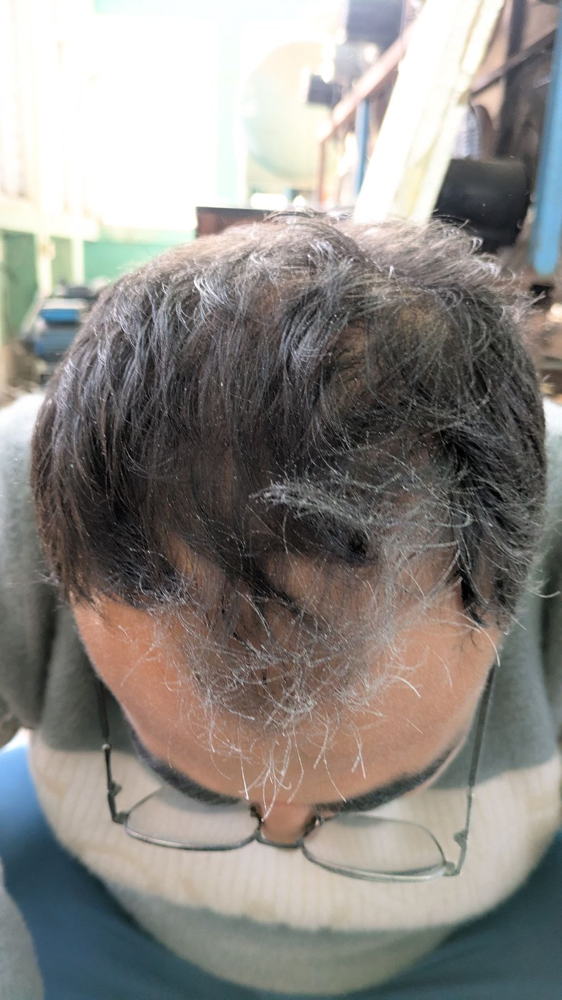

<!DOCTYPE html>
<html lang="en">
<head>
  <meta charset="UTF-8"/>
  <meta name="viewport" content="width=device-width, initial-scale=1.0"/>
  <title>Nischal Raut | Aerospace Engineer</title>

  <!-- Classy Fonts -->
  <link href="https://fonts.googleapis.com/css2?family=Playfair+Display:wght@600;700&family=Lato:wght@400;500;600&display=swap" rel="stylesheet">

  
</head>
<body>
  <!-- Navbar -->
  <nav>
    
Nischal Raut

    
&#9776;

    <ul>
      <li><a href="#hero">Home</a></li>
      <li><a href="#skills">Skills</a></li>
      <li><a href="#education">Education</a></li>
      <li><a href="#projects">Projects</a></li>
      <li><a href="#contact">Contact</a></li>
    </ul>
  </nav>

  <!-- Hero -->
  <section id="hero">
    

      

      

        <h1>Nischal Raut</h1>
        <h2>Aerospace Engineer</h2>
        
Hi! I'm Nischal Raut, aerospace engineer with deep interest in experimental aerodynamics & CFD.  
        Passion for combining computational models with hands-on fabrication defines my work.  
        Current Bachelor's aggregate: <b>76.71%</b>.

        <a href="Nischal_Raut_CV.pdf" class="btn">📄 Download CV</a>
      

    

  </section>

  <!-- Skills -->
  <section id="skills">
    <h2>Skills & Tools</h2>
    

      
CAD & Analysis: CATIA, ANSYS, SolidWorks, MATLAB

      
Programming: C, Python, MATLAB scripting

      
Simulation: Wind Tunnel Testing, Flow Visualization

      
Productivity: MS Office, LaTeX, AutoCAD

    

  </section>

  <!-- Education -->
  <section id="education">
    <h2>Education</h2>
    

<h3>Institute of Engineering, Pulchowk</h3>
Bachelor’s Aerospace Engineering (2019–2025)

<b>Aggregate 76.71%</b>

    

<h3>Omega International College</h3>
+2 Science GPA: 3.5

    

<h3>West Wing Secondary School</h3>
SEE GPA: 4.0

  </section>

  <!-- Projects -->
  <section id="projects">
    <h2>Projects</h2>
    

      

        <h3>Subsonic Wind Tunnel</h3>
        
Design & fabrication with gust generator

      

      

        <h3>B-52 Air Launch</h3>
        
B-52 modification for rocket air-launch

      

      

        <h3>Styrofoam Glider</h3>
        
Low-speed flight glider project

      

    

  </section>

  <!-- Modals -->
  

    

      &times;
      <h2>Subsonic Wind Tunnel</h2>
      
Designed and fabricated a subsonic open-jet wind tunnel with gust generator for turbulence studies.

      

        <button class="prev" onclick="prevSlide(this)">&#10094;</button>
        
        
        
        <button class="next" onclick="nextSlide(this)">&#10095;</button>
      

    

  

  

    

      &times;
      <h2>B-52 Air Launch</h2>
      
Conceptual modification and simulation of a B-52 Stratofortress for rocket carriage and air-launch.

      

        <button class="prev" onclick="prevSlide(this)">&#10094;</button>
        
        
        <button class="next" onclick="nextSlide(this)">&#10095;</button>
      

    

  

  

    

      &times;
      <h2>Styrofoam Glider</h2>
      
Glider designed with XFLR5, fabricated with styrofoam, tested and validated with flight experiments.

      

        <button class="prev" onclick="prevSlide(this)">&#10094;</button>
        
        
        <button class="next" onclick="nextSlide(this)">&#10095;</button>
      

    

  

  <!-- Contact -->
  <section id="contact">
    <h2>Contact</h2>
    
Email: <a href="mailto:nischalraut6@gmail.com">nischalraut6@gmail.com</a>

    
LinkedIn: <a href="https://www.linkedin.com/in/nischal-raut-1b2227314/">linkedin.com/in/nischal-raut</a>

  </section>

  
</body>
</html>
